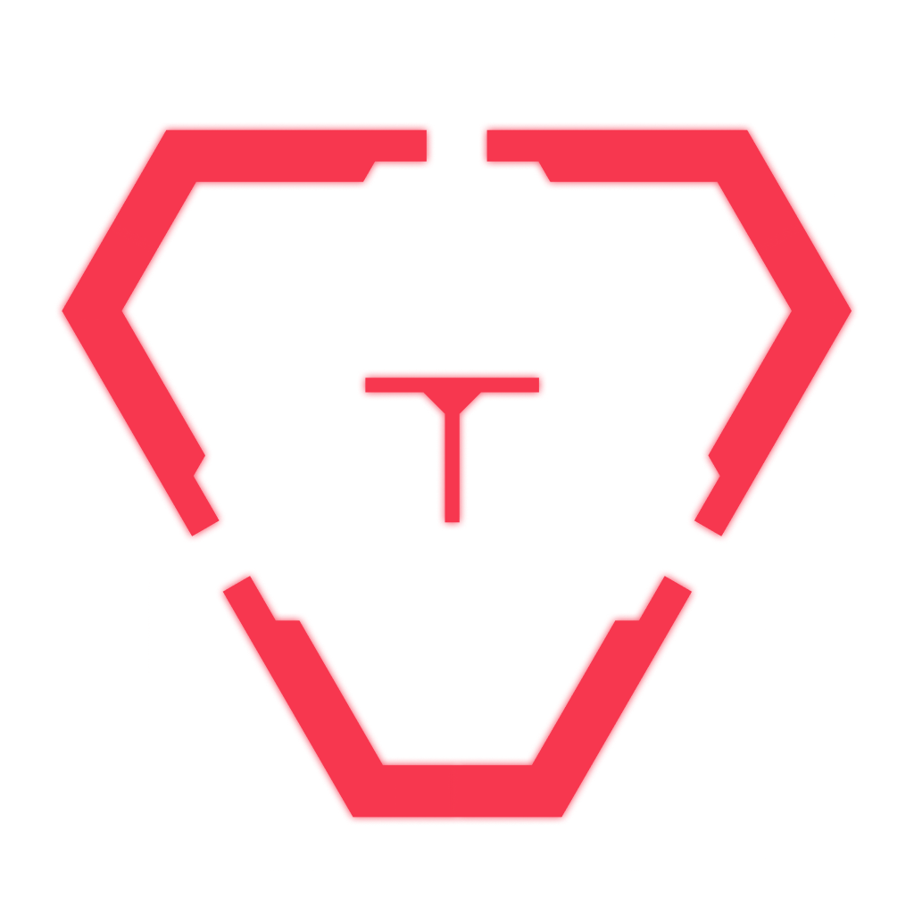
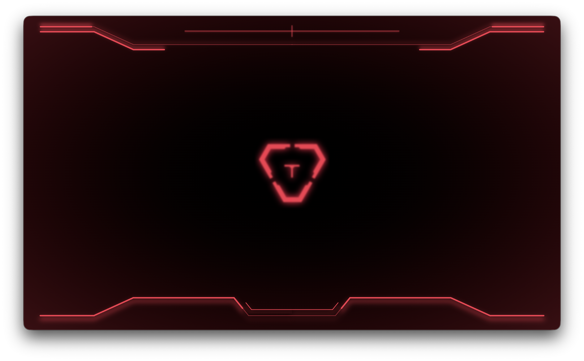
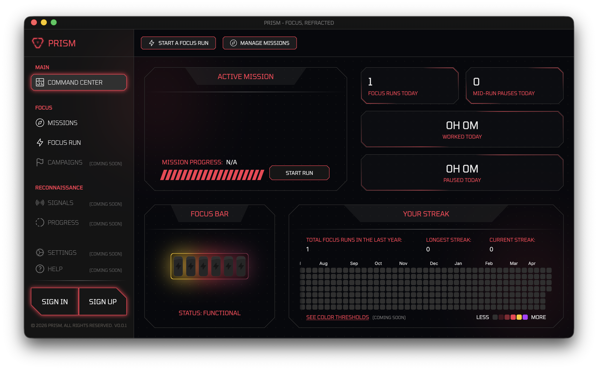
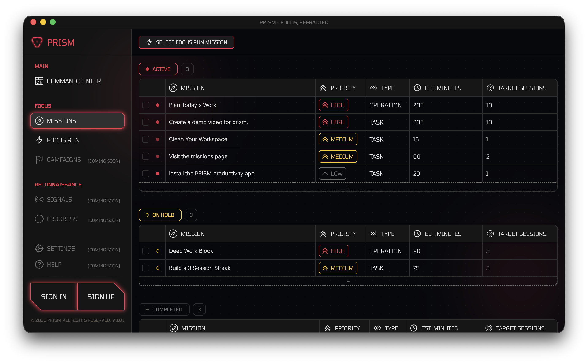
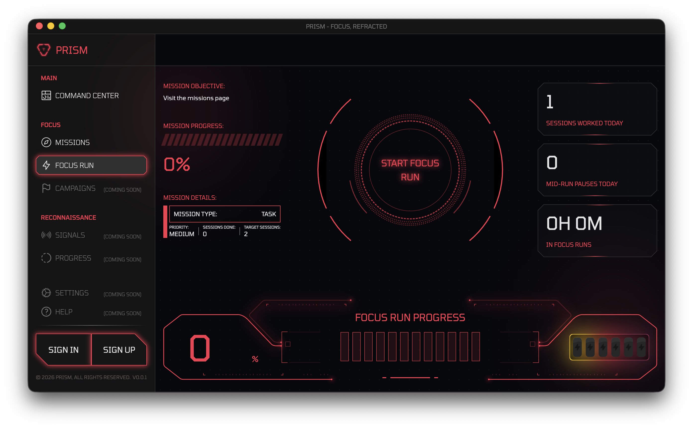

<table>
  <tr>
    <td></td>
    <td>
      <h1>Prism - Focus, Refracted</h1>
      
A futuristic productivity app built around focus and intention. Features focus runs, missions, focus bars, and a command center to manage everything from. The app allows users to create and manage their focus sessions with ease, while managing which tasks to prioritize and work on.

    </td>
  </tr>
</table>

## Demo Video

## Images

|                                                       |                                                       |
| :---------------------------------------------------: | :---------------------------------------------------: |
|  |  |
|              |          |

## Features

- **Focus Runs**: Users can start focus runs to work on specific tasks or projects. The app provides a timer and a focus bar to help users stay on track and maintain their concentration.
- **Missions**: Users can create missions, which are collections of tasks or goals.
- **Focus Bar**: The focus bar visually represents the user's progress during a focus run, providing motivation and a sense of accomplishment.
- **Command Center**: A centralized hub where users can manage their focus runs, missions, and tasks. The command center allows users to easily switch between different focus runs and missions, as well as track their overall productivity and progress.
- **Progress Tracking**: The app provides insights and analytics on the user's focus runs and missions, helping them understand their productivity patterns and make informed decisions about how to improve their focus and time management.
- **Customizable Settings (Coming Soon)**: Users can customize their focus runs and missions with different themes, sounds, and notifications to create a personalized experience that suits their preferences.

## How It Works

1. **Create a Mission**: Users can create a mission by adding tasks or goals they want to accomplish. This helps them organize their work and prioritize their focus runs.
2. **Start a Focus Run**: Users can start a focus run by selecting a mission and setting a timer. The app will provide a focus bar to help users stay on track and maintain their concentration during the run.
3. **Track Progress**: As users complete tasks and focus runs, the app will track their progress.
4. **Fill the Focus Bar**: The focus bar will fill up as users complete tasks and **_consecutive_** focus runs, providing a visual representation of their progress and motivation to keep going.
5. **Manage in Command Center**: Users can manage their focus runs, missions, and tasks in the command center, allowing them to easily switch between different focus runs and missions, as well as track their overall productivity and progress.
6. **Rinse and Repeat**: Users can continue to create new missions, start focus runs, and track their progress to maintain their focus and productivity over time.

## Technologies Used

- **Electron**: The app is built using Electron, which allows for cross-platform desktop application development using web technologies.
- **Vue.js**: The frontend of the app is developed using Vue.js, a progressive JavaScript framework for building user interfaces.
- **Node.js**: The backend of the app is powered by Node.js, which provides a runtime environment for executing JavaScript code on the server side.
- **SQLite**: The app uses SQLite for data storage, allowing users to save their missions, focus runs, and progress locally on their devices.
- **Tailwind CSS**: The app's styling is done using Tailwind CSS, a utility-first CSS framework that allows for rapid UI development and customization.
- **Vite**: The app is built using Vite, a fast and modern build tool that provides a smooth development experience with hot module replacement and optimized production builds.
- **Electron Builder**: The app is packaged and distributed using Electron Builder, which simplifies the process of creating installers for different platforms (Windows, macOS, Linux).

## Roadmap

- **Customizable Settings**: Allow users to customize their focus runs and missions with different themes, sounds, and notifications.
- **Notifications**: Implement notifications to remind users of upcoming focus runs or to encourage them to take breaks.
- **Menu Trays**: Add menu trays for quick access to the app's features and settings.
- **Campaign Mode**: Introduce a campaign mode where users can set long-term goals and track their progress over time.
- **Squad Mode**: Implement a squad mode where users can collaborate with friends or colleagues on shared missions and focus runs.

_Note: The roadmap is subject to change based on user feedback and development priorities._

## Thanks

Hope you guys enjoy the app! If you have any feedback or suggestions, feel free to reach out. (also I would love to see your focus runs and missions, so please share them with me!)

* This is an early release so the app is still in development and there may be some bugs, plus there is no auto update feature yet, so you will need to download the latest version from the releases page to get the latest features and bug fixes.

